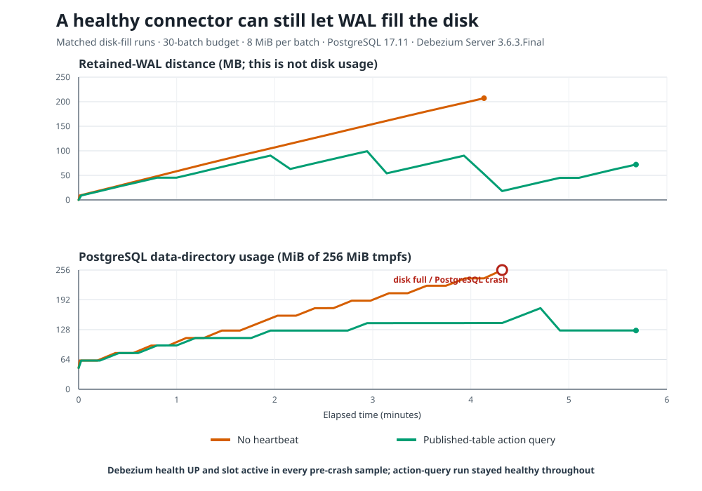

# CDC crash test



An earlier production incident filled a host disk after a Debezium replication slot stopped advancing and retained PostgreSQL WAL. Multiple Debezium instances competed for the slot. This single-connector lab reproduces the stalled-slot consequences, not that competition or the missed alert; it measures the quiet-source failure mode at a small, controlled scale and compares heartbeat configurations.

## Finding

Without a heartbeat, PostgreSQL filled the 256 MiB test filesystem on batch 24, after 23 completed batches, while Debezium health stayed UP. The final sample began about 84 ms after PostgreSQL logged the disk-full `PANIC`: health still read UP while its SQL metrics query failed.

With the published-table heartbeat action query, all 30 batches completed and the slot advanced. Peak filesystem use was 68%, but retained-WAL distance still peaked at 99,140,864 bytes. In this run the heartbeat limited slot lag; it did not eliminate WAL retention. Faster writes or a longer heartbeat interval can raise that peak, so the retained-WAL alert below still matters.

The [no-heartbeat summary](results/disk-fill/20260928T214209Z-no-heartbeat/summary.md) and [action-query summary](results/disk-fill/20260928T214702Z-action-query/summary.md) link the CSVs and PostgreSQL logs. The earlier stopped-connector runs are in [experiment history](docs/experiment-history.md).

A [second independently reset pair](results/disk-fill-repeat.md) reproduced the bounded outcome: the no-heartbeat case ran out of space on batch 24, and the action-query case completed all 30 batches. This is two of two local paired trials, not a guarantee for every workload.

### Heartbeat comparison

Debezium's [PostgreSQL documentation](https://debezium.io/documentation/reference/3.6/connectors/postgresql.html) describes heartbeat settings for low-change workloads. In three independently reset 10-minute runs, `heartbeat.interval.ms` alone did not advance the slot; updating a published heartbeat table did. Debezium health was UP and the slot active throughout all three runs.

| Heartbeat configuration | Confirmed flush LSN | Retained-WAL distance change | Peak distance |
| --- | --- | ---: | ---: |
| Disabled | Fixed | +1,627,088 bytes | 1,874,512 bytes |
| 10-second timer only | Fixed | +1,918,616 bytes | 1,918,712 bytes |
| 10-second timer plus published-table action query | Advanced | +326,952 bytes | 598,888 bytes |

The action-query result is evidence for this setup, not a production guarantee; it does not prove every event reached a durable sink. The [full comparison and CSVs](results/m4-comparison.md) contain the configuration and measurements. A separate [repeatability check](results/m4-stability-repeat.md) reproduced the same outcome in all three cases.

## What to do

- Use `heartbeat.action.query` to update a table in the connector's publication; don't rely on the timer alone.
- Measure retained WAL per slot from `restart_lsn` in `pg_replication_slots` (for example, `pg_wal_lsn_diff(pg_current_wal_lsn(), restart_lsn)`) and alert on it, not Debezium health alone.
- Consider `max_slot_wal_keep_size` as a last line of defense, understanding that it trades CDC completeness for database survival.
- Make sure disk alerts reach a person who can act on them.

## How the lab works

```text
PostgreSQL 17 ── published orders and heartbeat changes ──> Debezium Server 3.6 ──> HTTP receiver
      │
      ├── noise writes generate WAL but are not published
      └── replication-slot metrics ──> Go observer ──> CSV and Markdown summaries
```

`public.orders` represents application data captured by Debezium. `public.noise` generates WAL but is excluded from the publication, simulating a source where application writes do not produce events for this connector. `public.cdc_heartbeat` is a synthetic published table. The action-query configuration updates its row every ten seconds. The receiver logs events but is neither durable storage nor a completeness checker.

## Run it

Requirements: Docker with the Compose plugin, Go 1.25 or newer, and GNU Make (optional; direct Go commands work without it). The first run may need internet access to pull pinned images and Go modules.

Start the stack and run the heartbeat comparison:

```sh
make up
make heartbeat-comparison
```

The comparison asks for confirmation, then deletes this Compose project's PostgreSQL and Debezium volumes before each of the three scenarios so none inherits another's slot backlog. This permanently removes the database, replication slot, and connector offsets in those volumes. It leaves files under `results/` intact and stops the containers when finished. Type anything other than `YES` to cancel without resetting volumes.

The comparison takes about 30 minutes at its default settings. On Windows without Make, run it with `go run ./cmd/heartbeatcomparison`. The same Go command works on macOS and Linux; `make heartbeat-comparison` delegates to it on all supported platforms. The old `make m4-comparison` target remains as an alias.

To run the paired disk-fill experiment, use `make disk-fill`. It runs the no-heartbeat case followed by the action-query case, each with a fresh isolated stack and the same 30-batch budget, 8 MiB per batch, and 10-second pacing. Debezium remains running in both. Each run asks you to type `YES`; PostgreSQL's data directory is a dedicated **256 MiB tmpfs**, whose cap is verified before load starts. It does not fill a host filesystem or reuse the main lab's volumes. Cleanup destroys the temporary filesystem and connector-offset volume; the CSV, summary, and PostgreSQL log remain under `results/disk-fill/`. To run one case directly, use `go run ./cmd/diskfill -scenario=no-heartbeat` or `-scenario=action-query`.

Other experiments are available individually:

- `make e0` (or `go run ./cmd/e0`): published application writes as a progressing baseline.
- `make e1` (or `go run ./cmd/heartbeat -scenario=e1`): noise-only writes, no heartbeat.
- `make e2-timer` (or `go run ./cmd/heartbeat -scenario=e2-timer`): timer-only heartbeat.
- `make e2` (or `go run ./cmd/heartbeat -scenario=e2`): heartbeat action query updates the published table.
- `make e3` (or `go run ./cmd/e3`): stop Debezium during writes, observe slot and health, then restart it.

Each experiment runs for ten minutes by default and saves a timestamped `observations.csv` and `summary.md` below `results/`. For a wiring check, pass `-duration=90s`; a short run is not a full experiment verdict. Individual scenarios preserve the current database and offsets, so use the reset comparison command for a fair side-by-side heartbeat test.

PostgreSQL uses passwordless `trust` authentication for this local lab, with host ports bound to loopback. Do not expose it to a shared network or reuse its database settings in production. Use `make down` to stop containers while keeping data, and `make up` to resume. `make reset` permanently removes this project's database and connector volumes.

## Interpreting the measurements

An LSN (Log Sequence Number) is a position in PostgreSQL's write-ahead log. `confirmed_flush_lsn` is the position the logical consumer has confirmed; `restart_lsn` is the oldest position the slot might still need. If the connector is healthy but these positions stop progressing, PostgreSQL may retain more WAL for the slot.

`retained_wal_bytes` is the LSN-distance from `restart_lsn` to current WAL. It indicates slot pressure but is **not** disk usage. `pg_wal_bytes` measures allocated files in PostgreSQL's WAL directory, which can remain the same size as files are reused. A health result of `UP` or an active slot does not alone mean the connector is keeping up. See [CDC terms](docs/cdc-terms.md) and [observer field definitions](docs/m2-observer.md).

## Scope and history

The experiments use local PostgreSQL 17.11, Debezium Server 3.6.3.Final, and a non-durable HTTP receiver. They do not establish safety for managed databases, failover, other CDC tools, or production-scale incidents. Historical full-stack acceptance results—including the earlier sequential run where the active-heartbeat case inherited a backlog—are in [experiment history](docs/experiment-history.md). For design tradeoffs, see the [architecture decisions](docs/adr/).
